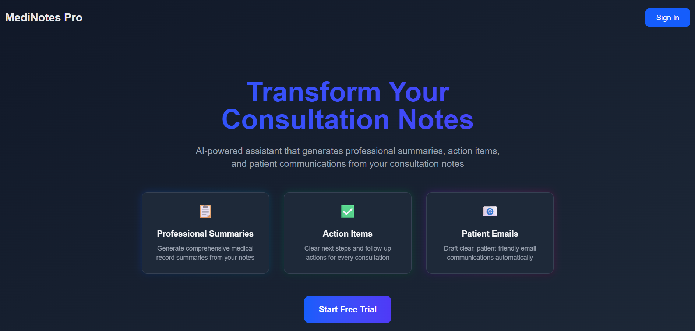
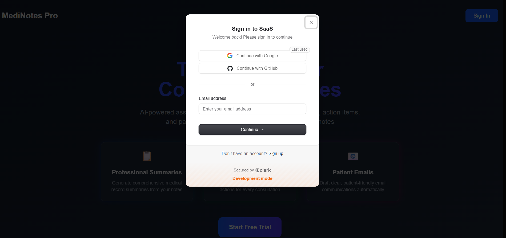
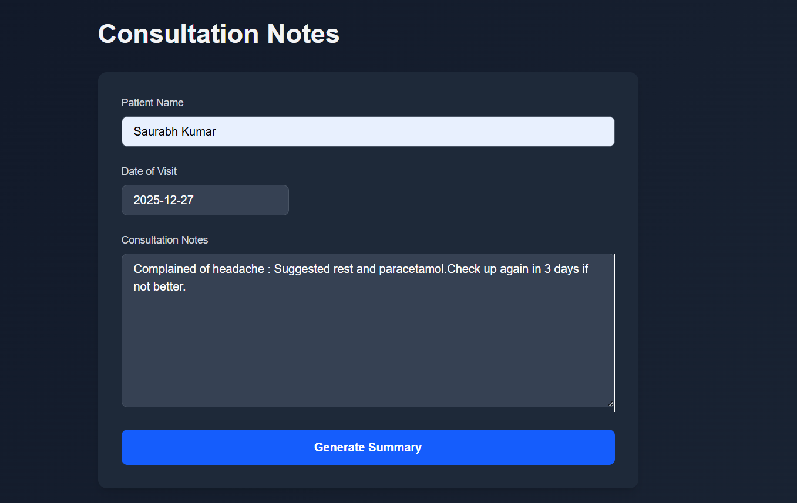
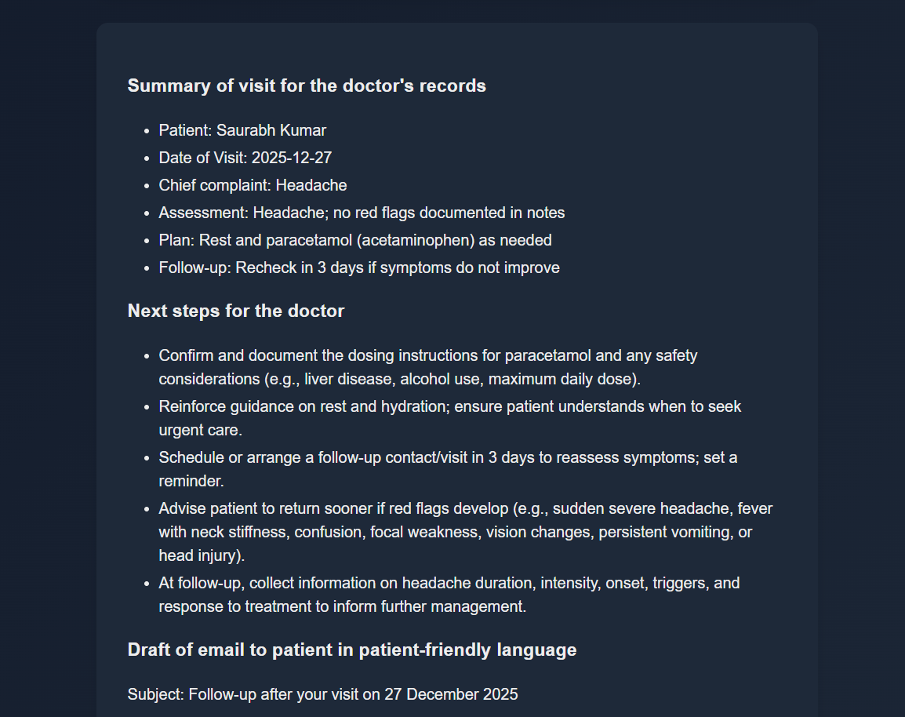
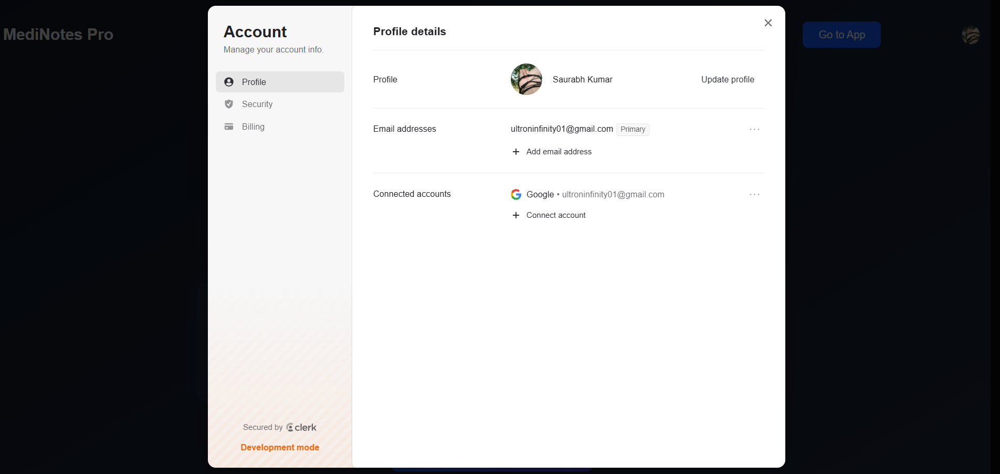

# 🏥 MediNotes Pro

> Transforming messy consultation notes into professional documentation with AI

## 👋 Hey there! Welcome to my project

I built **MediNotes Pro** because I saw healthcare professionals drowning in paperwork after every patient visit. Instead of focusing on patient care, they were spending precious hours writing summaries, creating action plans, and drafting follow-up emails. I thought to myself: *"AI can do this better and faster."*

So here we are! 🚀

## 🎯 What Does This Do?

MediNotes Pro is an AI-powered consultation assistant that takes your rough notes from patient visits and transforms them into three essential outputs:

1. **📋 Professional Medical Summaries** - Clean, comprehensive records ready for your EHR
2. **✅ Action Items** - Clear next steps so nothing falls through the cracks
3. **📧 Patient-Friendly Emails** - Draft communications in language your patients actually understand

## 🌟 Why I'm Proud of This

- **Real-time AI Streaming**: I implemented streaming responses using OpenAI's API, so you see results appear as they're generated (no more waiting!)
- **Secure Authentication**: Integrated Clerk for seamless user management
- **HIPAA-Conscious Design**: Built with healthcare compliance in mind
- **Modern Tech Stack**: Combined Next.js, React, FastAPI, and TypeScript for a snappy, type-safe experience
- **Beautiful UI**: Crafted with Tailwind CSS and dark mode support

## 🛠️ Tech Stack

I chose each technology deliberately to create a production-ready application:

**Frontend:**
- ⚛️ **Next.js 16** - For server-side rendering and optimal performance
- 🎨 **Tailwind CSS** - Rapid, responsive UI development
- 🔐 **Clerk** - Authentication that just works
- 📝 **React Markdown** - Beautiful rendering of AI-generated content

**Backend:**
- 🐍 **FastAPI** - Blazing fast Python API framework
- 🤖 **OpenAI API** - The brain behind the summaries
- 🔒 **Clerk Auth** - Secure JWT verification on the backend

**DevOps:**
- 🐳 **Docker** - Containerized for consistent deployment
- 📦 **Docker Compose** - One-command setup

## 🚀 Getting Started

### Prerequisites
---

## 📸 Screenshots & Demo

<div align="center">
  


<table>
  <tr>
    <td width="50%">
      
    </td>
    <td width="50%">
      
    </td>
  </tr>
  <tr>
    <td width="50%">
      
    </td>
    <td width="50%">
      
    </td>
  </tr>
</table>

</div>

---


Make sure you have these installed:
- Node.js (v20+)
- Python (3.9+)
- Docker (optional but recommended)

### Environment Variables

I've set this up to need just a few environment variables. Create a `.env.local` file:

```env
# Clerk Authentication
NEXT_PUBLIC_CLERK_PUBLISHABLE_KEY=your_clerk_publishable_key
CLERK_SECRET_KEY=your_clerk_secret_key
CLERK_JWKS_URL=your_clerk_jwks_url

# OpenAI
OPE
npm run dev
```

**Backend:**
```bash
cd api
pip install -r requirements.txt
uvicorn server:app --reload
```


<!-- Replace with a screenshot showing the app in action -->

## 📸 Screenshots

### Landing Page

<!-- Replace with a full screenshot of your beautiful landing page -->

### Consultation Input

<!-- Replace with a screenshot of the consultation notes input interface -->

### AI-Generated Results

<!-- Replace with a screenshot showing the three sections of generated content -->

### Dark Mode

<!-- Replace with a screenshot showcasing dark mode -->

## 🎨 Features in Detail

### Real-Time Streaming
I implemented Server-Sent Events (SSE) to stream AI responses in real-time. You don't have to wait for the entire response - you see each word as it's generated, creating a more engaging user experience.

### Secure by Design
Every API request is authenticated using Clerk's JWT verification. I made sure that only authenticated users can access the consultation summary endpoint, protecting both the service and patient data.

### Markdown Rendering
The AI responses are formatted in Markdown and beautifully rendered with proper typography, making the output professional and easy to read.

## 🔒 Security & Compliance

I take security seriously:
- ✅ JWT-based authentication on all API endpoints
- ✅ Secure environment variable management
- ✅ No patient data stored (stateless design)
- ✅ HTTPS-ready deployment architecture

## 📚 What I Learned

Building this project taught me so much:
- How to implement real-time streaming with FastAPI and Next.js
- Integrating authentication seamlessly across full-stack apps
- Working with OpenAI's streaming API
- Creating accessible, beautiful UIs with Tailwind CSS
- Containerizing multi-service applications with Docker

## 🔮 Future Plans

I'm excited to add:
- [ ] Support for multiple languages
- [ ] Integration with popular EHR systems
- [ ] Voice-to-text for hands-free note entry
- [ ] Advanced analytics and insights
- [ ] Template customization for different specialties

## 🤝 Contributing

Found a bug or have a feature idea? I'd love to hear from you! Feel free to open an issue or submit a pull request.

## 📄 License


Have questions or want to chat about the project? Reach out!

---

**Built with ❤️ for healthcare professionals who deserve better tools**


<!-- Replace with a nice closing image or logo -->
